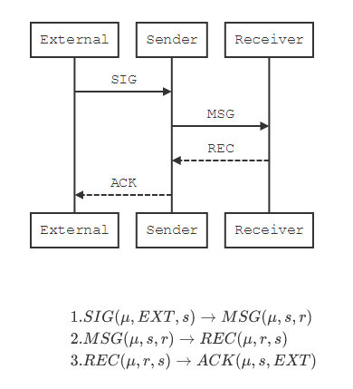

# Strict Demo Config

A demo with no logical predicates in the strict mode.

Everything is the **same** with [simple_demo](../simple_demo) except `strict` and  `non-strict` .

## Difference

- sender.py

  ```diff
    messages_to_receive: dict = {
        'SIG': (
            lambda message_data, entity_data: None,
            (
  -             ['SIG'],
  +             ['', 'SIG'],
                lambda entity_data: True,
                [
                    ('MSG', lambda entity_id, entity_data: [entity_id], lambda entity_data: {})
                ]
            )
        ),
        'REC': (
            lambda message_data, entity_data: None,
            (
  -             ['SIG', 'REC'],
  +             ['', 'SIG', 'REC'],
                lambda entity_data: True,
                [
                    ('ACK', lambda entity_id, entity_data: [entity_id], lambda entity_data: {})
                ]
            )
        )
    }
  ```

- receiver.py

  ```diff
    messages_to_receive: dict = {
        'MSG': (
            lambda _0, _1: None,
            (
  -             ['MSG'],
  +             ['', 'MSG'],
                lambda _: True,
                [
                    ('REC', lambda entity_id, _: [entity_id], lambda _: {})
                ]
            )
        )
    }
  ```

## Demo Model



## Config Content

### Public Part

- Machines Addresses

  ```
  External: http://127.0.0.1:8001
  Sender:   http://127.0.0.1:8002
  Receiver: http://127.0.0.1:8003
  ```

- Messages Paths

  ```python
  {
      'SIG': ('External', 'Sender'),
      'MSG': ('Sender', 'Receiver'),
      'REC': ('Receiver', 'Sender'),
      'ACK': ('Sender', 'External')
  }
  ```

### Private Part

Shown in `.py` files.

