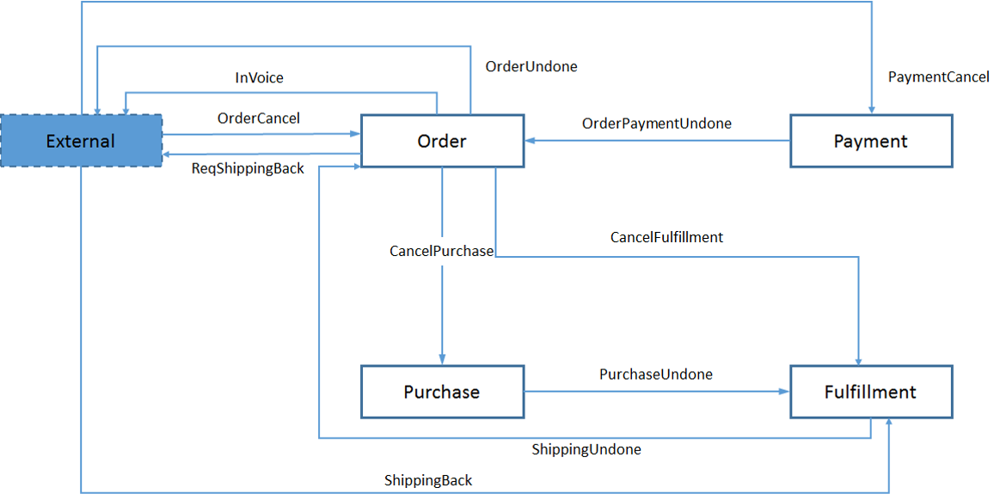
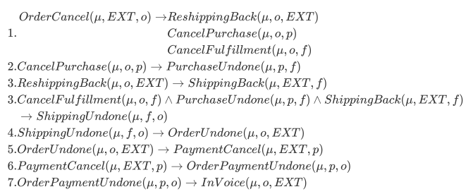
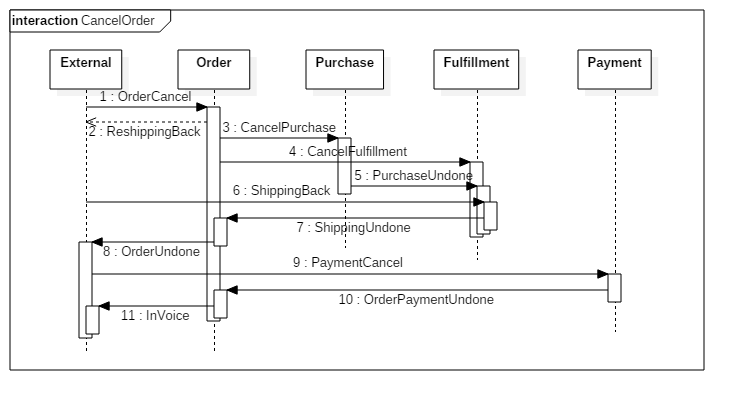

# Cancel Order Choreography 

## The Whole Artifact

## Business Rules

$$
\begin{aligned}
1.&\begin{aligned}
OrderCancel(\mu,EXT,o)\rightarrow&ReshippingBack(\mu,o,EXT)\\
&CancelPurchase(\mu,o,pu)\\
&CancelFulfillment(\mu,o,f)
\end{aligned}\\
2.&CancelPurchase(\mu,o,pu)\rightarrow PurchaseUndone(\mu,pu,f)\\
3.&ReshippingBack(\mu,o,EXT)\rightarrow ShippingBack(\mu,EXT,f)\\
3.&CancelFulfillment(\mu,o,f)\wedge PurchaseUndone(\mu,pu,f)\wedge ShippingBack(\mu,EXT,f)\\
&\rightarrow ShippingUndone(\mu,f,o)\\
4.&ShippingUndone(\mu,f,o)\rightarrow OrderUndone(\mu,o,EXT)\\
5.&OrderUndone(\mu,o,EXT)\rightarrow PaymentCancel(\mu,EXT,pa)\\
6.&PaymentCancel(\mu,EXT,pa)\rightarrow OrderPaymentUndone(\mu,pa,o)\\
7.&OrderPaymentUndone(\mu,pa,o)\rightarrow InVoice(\mu,o,EXT)
\end{aligned}
$$

Here is the picture for the GFM:

## Interaction Picture

## Something Else

- [Xmind File for Cancel Order](ArtifactDescription.xmind)
- [Cancel Order Implementation With Model](CancelOrderImplementation.java)
- [StarUML File for Cancel Order Interaction](CancelOrderInteraction.mdj)

