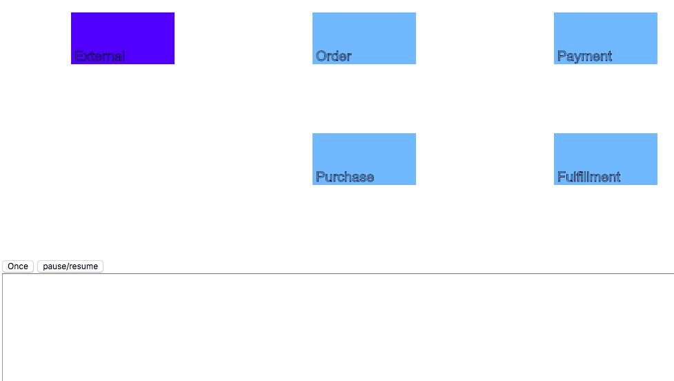
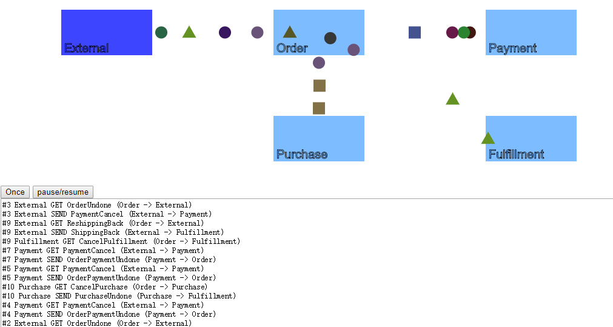

# Web Demo

[Here](CancelOrder) is a demo for [Cancel Order Artifact](/Research/CancelOrder) in html5 and es6.

## Looks Like

- Idle Status

  

- After Click `Once` 

  

  Here is a `.gif` version for the whole artifact: [afterClickOnce.gif](afterClickOnce.gif)

- Lots of Messages

  

## Apply New Business Rules

### Cancel Order Business Rules

Here is the business rules of Cancel Order Artifact:


In JavaScript code, the business rules is defined in [`cancel-order.js`](CancelOrder/cancel-order.js):

```javascript
function once() {
    let artifact = new Artifact();
    artifacts.push(artifact);
    artifact.id = ++artifactNum;
    writeWhiteBoard('#' + artifact.id + ' --- BEGIN ---\n');
    createOrderCancel(artifact);
}

function createOrderCancel(artifact) {
    writeWhiteBoard('#' + artifact.id + ' External SEND OrderCancel (External -> Order)\n');
    let orderCancel = new Message(external, order, artifact, () => {
        writeWhiteBoard('#' + artifact.id + ' Order GET OrderCancel (External -> Order)\n');
        createReshippingBack(artifact);
        createCancelPurchase(artifact);
        createCancelFulfillment(artifact);
    });
    artifact.msgs.push(orderCancel);
}

function createReshippingBack(artifact) {
    writeWhiteBoard('#' + artifact.id + ' Order SEND OrderCancel (Order -> External)\n');
    let reshippingBack = new Message(order, external, artifact, () => {
        writeWhiteBoard('#' + artifact.id + ' External GET OrderCancel (Order -> External)\n');
        createShippingBack(artifact);
    });
    artifact.msgs.push(reshippingBack);
}

function createShippingBack(artifact) {
    writeWhiteBoard('#' + artifact.id + ' External SEND ShippingBack (External -> Fulfillment)\n');
    let shippingBack = new Message(external, fulfillment, artifact, () => {
        writeWhiteBoard('#' + artifact.id + ' Fulfillment GET ShippingBack (External -> Fulfillment)\n');
        artifact.isShippingBackGot = true;
        if (artifact.isCancelFulfillmentGot && artifact.isPurchaseUndoneGot && artifact.isShippingBackGot) {
            createShippingUndone(artifact);
        }
    });
    artifact.msgs.push(shippingBack);
}

...

function createCancelFulfillment(artifact) {
    writeWhiteBoard('#' + artifact.id + ' Order SEND CancelFulfillment (Order -> Fulfillment)\n');
    let cancelFulfillment = new Message(order, fulfillment, artifact, () => {
        writeWhiteBoard('#' + artifact.id + ' Fulfillment GET CancelFulfillment (Order -> Fulfillment)\n');
        artifact.isCancelFulfillmentGot = true;
        if (artifact.isCancelFulfillmentGot && artifact.isPurchaseUndoneGot && artifact.isShippingBackGot) {
            createShippingUndone(artifact);
        }
    });
    artifact.msgs.push(cancelFulfillment);
}
```

### How to Apply

- Function `Once`

  `Once` defines the entrance of each Artifact. Namely, `once` need to call the function of the beginning message. Like this:

  ```javascript
  function once() {
      let artifact = new Artifact();
      artifacts.push(artifact);
      artifact.id = ++artifactNum;
      writeWhiteBoard('#' + artifact.id + ' --- BEGIN ---\n');
      createOrderCancel(artifact); // Here calls the function of OrderCancel.
  }
  ```

  When apply the new artifact on the web demo, you need change the function called:

  ```Diff
   function once() {
       let artifact = new Artifact();
       artifacts.push(artifact);
       artifact.id = ++artifactNum;
       writeWhiteBoard('#' + artifact.id + ' --- BEGIN ---\n');
  -    createOrderCancel(artifact); // Here calls the function of OrderCancel.
  +    createAnotherMessage(artifact); // Here calls the function you need.
   }
  ```

- Functions for Messages

  For each message, we need a function to create/handle it.

  We also need to store the business rule of each message in the function.

  Here is the **basic** template:

  ```javascript
  function createSomeMessagae(artifact) {
      let someMessage = new Message(from_entity, to_entity, artifact, callbackFunction);
      artifact.msgs.push(someMessage);
  }
  ```

  What you need to modify is

  - `from_entity`, `to_entity`

    ```haskell
    it `elem` [external, order, payment, purchase, fulfillment]
    ```

  - `callbackFunction`

    1. After the the message reach `to_entity`, `callbackFunction` will be called. The business rule is stored here.
    2. Because artifact is a javascript object, you can store data for complex business rules in it.

  Here is an example:

  ```javascript
  function createShippingBack(artifact) {
      writeWhiteBoard('#' + artifact.id + ' External SEND ShippingBack (External -> Fulfillment)\n'); // writeWhiteBoard is an util function for white board.
      let shippingBack = new Message(external, fulfillment, artifact, () => {
          writeWhiteBoard('#' + artifact.id + ' Fulfillment GET ShippingBack (External -> Fulfillment)\n');
          artifact.isShippingBackGot = true;
          if (artifact.isCancelFulfillmentGot && artifact.isPurchaseUndoneGot && artifact.isShippingBackGot) {
              createShippingUndone(artifact);
          }
      });
      artifact.msgs.push(shippingBack);
  }
  ```
